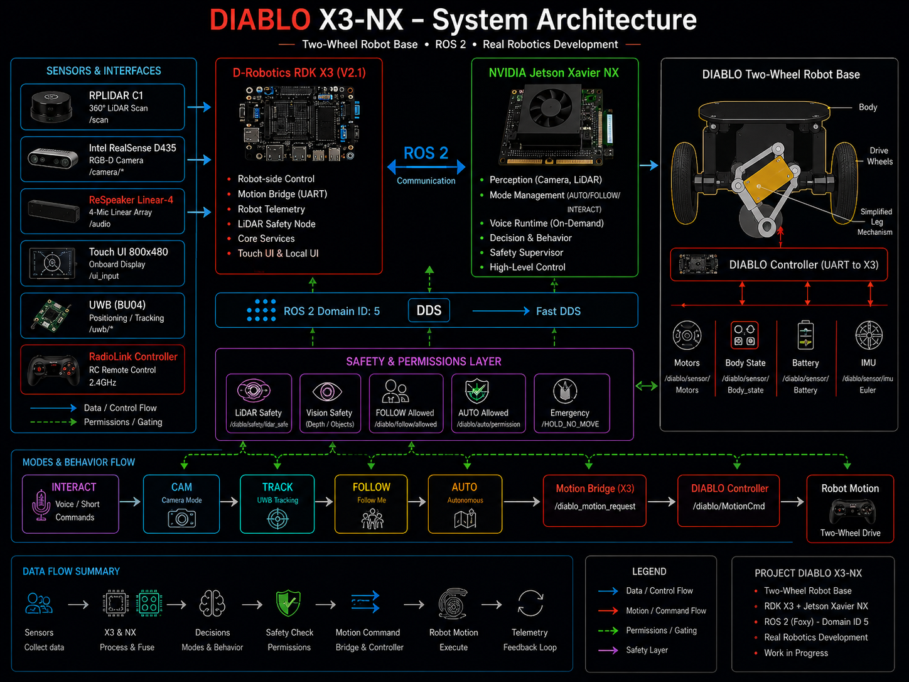

# DIABLO X3-NX

❤️ **Support the development of DIABLO X3-NX:** [Support the project](https://paypal.me/GVM106110)

**Independent real-hardware ROS 2 robotics development project by GVM**

## Real robot demo

▶️ **[DIABLO X3-NX — INTERACT Voice Command Test | Real Robot](https://www.youtube.com/watch?v=1tYXHSDjvRE)**

Real-hardware test of DIABLO's INTERACT voice-command path on the physical X3-NX robot during active development.

> 🚧 **EARLY PUBLIC PREVIEW — WORK IN PROGRESS**  
> DIABLO X3-NX is intentionally documented while it is being developed. Architecture, interfaces, operating modes and implementation details may change as the real robot evolves.

DIABLO X3-NX extends the Direct Drive Technology DIABLO two-wheel robot platform with a D-Robotics RDK X3, an NVIDIA Jetson Xavier NX, ROS 2, LiDAR, depth vision, interaction and layered safety logic.

This repository is intended to become the **technical history of the project**: idea, hardware, architecture, user interface, ROS 2 structure, operating modes, verified tests, design decisions, development changes, real source snapshots and later real-robot media.

**Current principle:** only functions and capabilities that have been verified on the real robot are presented as working features.

## Explore the project

- [Project overview](docs/PROJECT_OVERVIEW.md)
- [System architecture](docs/ARCHITECTURE.md)
- [Hardware](docs/HARDWARE.md)
- [Safety](docs/SAFETY.md)
- [Operating modes](docs/modes/)
- [ROS 2 — start here](ros2/START_HERE.md)
- [ROS 2 architecture and topics](docs/ros2/OVERVIEW.md)
- [ROS 2 source area](ros2/README.md)
- [Real NX development source](ros2/development_workspace/README.md)
- [Current integration source — 2026-09-04](ros2/development_workspace/CURRENT_SOURCE_2026-09-04.md)
- [Real source publication roadmap](ros2/development_workspace/SOURCE_PUBLICATION_ROADMAP.md)
- [Current development status](docs/development/CURRENT_STATUS.md)
- [Design decisions](docs/development/DESIGN_DECISIONS.md)
- [Human-AI development workflow](docs/development/HUMAN_AI_WORKFLOW.md)
- [Validation and release readiness](docs/validation/README.md)
- [Known limitations](docs/validation/KNOWN_LIMITATIONS.md)
- [Roadmap](ROADMAP.md)
- [Changelog](CHANGELOG.md)
- [Contributing](CONTRIBUTING.md)
- [First public project preview](docs/PUBLIC_PREVIEW.md)

## Development source

Real code from the NX `diablo_ws/src` workspace is published under [`ros2/development_workspace/`](ros2/development_workspace/).

The first reviewed snapshot from **2026-08-19** contains project-specific ROS 2 packages for NX bringup, safety and UWB/tracker integration.

A newer reviewed integration selection from **2026-09-04** now adds real current source for important Camera/perception, FOLLOW manager, AUTO supervisor, LiDAR/safety, INTERACT command and on-demand voice-runtime components. See [`CURRENT_SOURCE_2026-09-04.md`](ros2/development_workspace/CURRENT_SOURCE_2026-09-04.md) for the exact publication boundary and archive hash.

This is a selected development-source publication, not a complete mirror of the live workspace. Larger current implementations such as the complete FOLLOW action logic and central mode manager remain outside this public selection rather than being replaced with simplified or synthetic code.

After this integration-source publication, the next **large source expansion is intentionally paused** while DIABLO continues toward stable real-world use. A future stable release will be prepared separately with stronger deployment, licensing and repeatable validation documentation.

The public source is intended to show the **real architecture and implementation direction** while making it clear that `main` is not yet a stable plug-and-play release.

## Current X3 touch UI

The first current UI presentation image is available in [`media/images/ui/`](media/images/ui/).

More photos, UI images and real-robot demonstration videos will be added progressively when time allows.

## Support the project

DIABLO X3-NX is an independent real-hardware development project. The current public support option is [PayPal.Me](https://paypal.me/GVM106110). GitHub Sponsors may be added later as an additional channel.

Support can help fund development hardware, sensors, electronics, battery prototypes, test equipment and continued public documentation. Sponsorship does not change the project's technical verification or safety standards.

## Community

Questions, technical discussion, ideas and suggestions are welcome through **GitHub Discussions**. The project is open for observation and discussion while remaining under active development.

External feedback is especially useful as the project moves from isolated verified functions toward repeatable full-system real-world validation.

---

**Project creator:** GVM  
**AI-assisted development:** ChatGPT and Codex by OpenAI

Technology names identify tools and platforms used by the project and do not imply sponsorship, endorsement or partnership.
