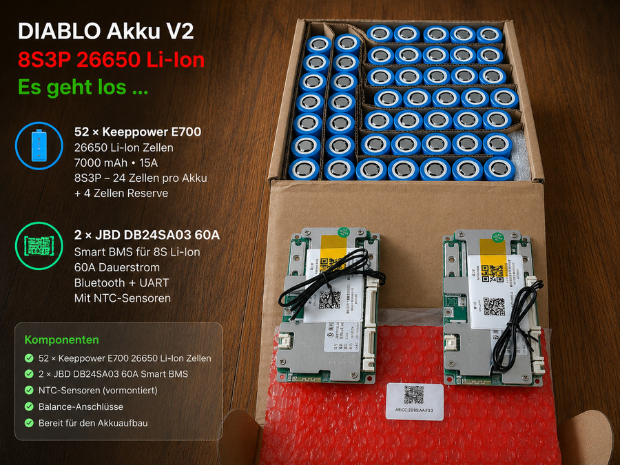

# Hardware

> 🚧 **ACTIVE DEVELOPMENT**
>
> This page documents the real hardware currently used in DIABLO X3-NX as well as hardware subsystems that are being redesigned or upgraded.

## Robot platform

- Direct Drive Technology DIABLO
- Two-wheel self-balancing robot platform
- Original DIABLO robot controller retained
- Robot controller connected to the RDK X3 via UART

## Robot-side computer — RDK X3

- D-Robotics RDK X3 V2.1
- Runs the robot-side ROS 2 layer
- Direct interface to the DIABLO controller
- LiDAR interface
- Motion bridge
- Robot-side touch UI
- ROS 2 Foxy

## High-level computer — Jetson Xavier NX

- NVIDIA Jetson Xavier NX
- 16 GB RAM
- Installed in a reComputer J2022 platform
- Ubuntu 20.04
- Used for:
  - perception
  - vision processing
  - FOLLOW logic
  - autonomous behavior
  - safety supervision
  - camera management
  - voice / interaction

## Touch interface

- Waveshare HDMI touchscreen
- Resolution: 800 × 480
- Connected to the RDK X3
- Custom DIABLO X3 touch UI

Current UI modes include:

- TRACK
- CAM
- AUTO
- LIDAR
- INTERACT
- SHOW
- FOLLOW

## LiDAR

- RPLIDAR C1
- ROS 2 scan topic: `/scan`
- Used for obstacle detection and safety zones
- Front, diagonal, side and rear areas are evaluated separately

## Depth / RGB vision

- Intel RealSense D435
- RGB + depth camera
- Used for person detection, target tracking and depth information
- Vision data is combined with other safety information rather than replacing the LiDAR safety layer

## Audio / interaction

- ReSpeaker XVF3800 4-microphone array
- USB audio interface
- Used by the on-demand INTERACT voice subsystem

## UWB

- Ai-Thinker BU04
- UWB subsystem under development
- Intended for additional positioning / tracking experiments

## Controller communication

DIABLO controller <-> RDK X3:

- UART
- 460800 baud
- Robot telemetry and motion-control interface

## Current battery system

**Status: CURRENT / being replaced**

- Chemistry: LiFePO4
- Configuration: 9S2P
- Nominal voltage: 28.8 V
- Capacity: 6 Ah
- Approximate nominal energy: 172.8 Wh

The current battery works with the robot but runtime and available power reserve motivated the development of a new battery system.

## Battery V2

**Status: IN DEVELOPMENT**

The next DIABLO battery generation is based on:

- 8S3P configuration
- 26650 Li-ion cells
- Keeppower 26650-E700
- 7000 mAh cells
- 24 cells per battery pack
- Two identical removable battery packs planned
- 52 cells available in total: 48 for two packs + 4 reserve cells
- 2 × JBD DB24SA03 Smart BMS
- 60 A BMS version
- Bluetooth + UART monitoring

### AutoSwap Dock V1 concept

The following image documents the current concept for a future DIABLO battery dock. The concept supports two operating ideas: automatic battery replacement and docking for charging. It is a design concept under active development and is not yet presented as a completed or validated subsystem.

The mechanical battery design must remain inside the available DIABLO battery space.

Specifications may still change as the pack is designed, assembled and tested on the real robot.

## Hardware development philosophy

DIABLO X3-NX is intentionally documented while it is being built.

Hardware listed as CURRENT is installed or used on the real robot. Hardware marked IN DEVELOPMENT may change before becoming the productive configuration.

Photos, mounting details, wiring diagrams and real-robot videos will be added progressively.
