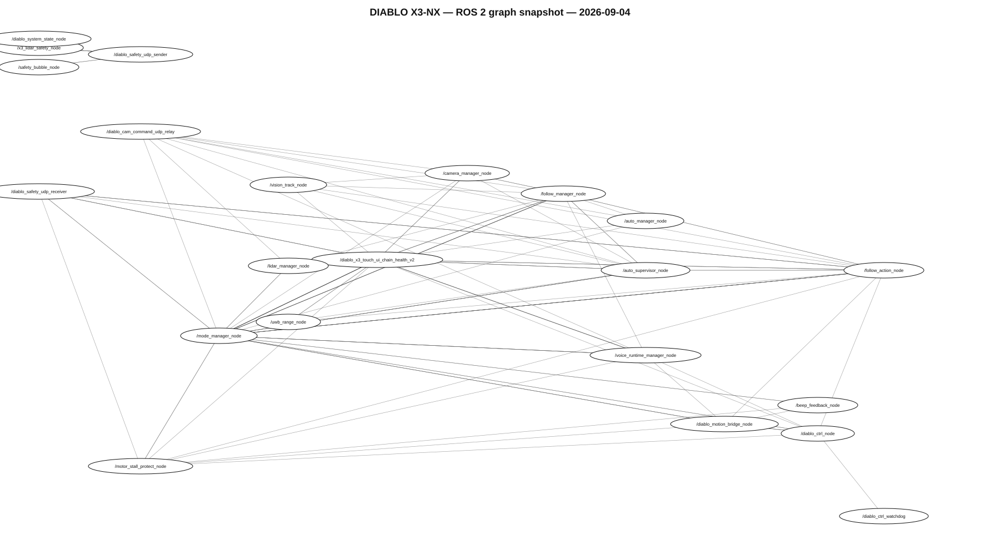

# ROS 2 Overview

> 🚧 **WORK IN PROGRESS — ACTIVE ROBOT DEVELOPMENT**

This section documents selected ROS 2 interfaces and architecture used by DIABLO X3-NX.

Reviewed source from the real NX `diablo_ws/src` workspace is published progressively under [`../../ros2/development_workspace/`](../../ros2/development_workspace/). New visitors can use [`../../ros2/START_HERE.md`](../../ros2/START_HERE.md) for a short source-oriented technical tour.

## Main ROS 2 areas

- Robot control and telemetry
- Sensor data
- Safety state
- Camera and perception
- FOLLOW and autonomous behavior
- Mode management
- On-demand interaction
- X3 ↔ Jetson NX communication

## Runtime graph snapshot — 2026-09-04

The following graph is a real ROS 2 runtime connectivity snapshot from the DIABLO X3-NX development system. It shows the dense relationships between nodes and topics across the active stack.

Open the SVG directly for a larger, zoomable view.

## Public source status

The repository now contains the original reviewed foundation snapshot plus a selected current integration snapshot covering important Camera/Perception, FOLLOW, AUTO, runtime/mode ownership and INTERACT components.

The current integration-source review is documented in [`../../ros2/development_workspace/CURRENT_SOURCE_2026-09-04.md`](../../ros2/development_workspace/CURRENT_SOURCE_2026-09-04.md).

Larger source expansion can wait until DIABLO reaches a later stable in-use state and a formal release is prepared.

## Important note

This documentation is not yet intended as a complete plug-and-play software distribution. Topics, parameters and implementation details may change while the robot is developed.

## Related pages

- [ROS 2 source — start here](../../ros2/START_HERE.md)
- [Nodes and runtime components](NODES_AND_SERVICES.md)
- [Component status](PACKAGE_STATUS.md)
- [Safety and motion flow](SAFETY_AND_MOTION_FLOW.md)
- [Topic map](TOPICS.md)
- [X3 / NX role split](X3_NX_ROLES.md)
- [Data flow](DATA_FLOW.md)
